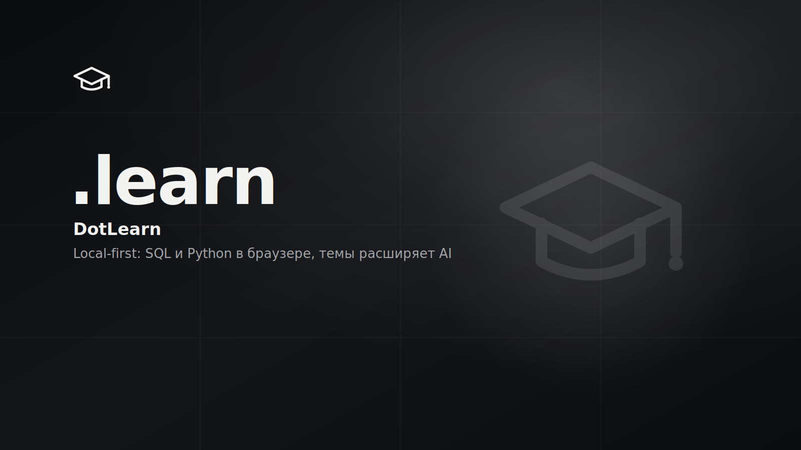

# .learn

<p>
  
  
  
  <!-- loc:start --><!-- loc:end -->
</p>



<!-- audit:start -->
<p>
  
  
  
  
  
</p>
<!-- audit:end -->

Local-first монорепо для обучения программированию, где урок - не статический текст, а интерактивный модуль. Каждая тема - типобезопасный пакет (теория в MDX, упражнения в YAML, всё под Zod): теорию сопровождают встроенные визуализации, а задачи проверяются прямо в браузере через sql.js и Pyodide в Web Workers. Контент генерируется офлайн скиллом `lesson-forge`; рантайм работает на чистой логике, без AI, `apps/api` опционален.

## Что внутри

- **Интерактивная теория, не стена текста.** Более 40 визуализаций и схем встроены в уроки: JOIN-ы и GROUP BY, хеш-таблицы и консистентное кольцо, attention и токенизация, градиентный спуск и перцептрон, IoU и NMS. Плюс графики, иллюстрации, сноски, чекпойнты и глоссарий по ходу чтения (MDX + Shiki).
- **Проверочные вопросы почти в каждой теме.** theory-quiz с мгновенной проверкой и разбором - закрепить теорию, не уходя со страницы.
- **Задачи с живым рантаймом и результатом в реальном времени.** 7 типов упражнений (theory-quiz, sql-query, python-function, javascript-function, fill-in-blanks, predict-output, git-challenge) исполняются прямо в браузере на Monaco-редакторе, sql.js и Pyodide в Web Workers. Результат виден сразу: визуализатор SQL-запросов, пошаговый разбор Python (PyStepper), интерактивные git-задачи с проверкой состояния репозитория.
- **Свободная песочница.** Отдельная страница `/sandbox` - интерактивные SQL- и Python-окружения для экспериментов вне уроков: Monaco-редактор, готовые шаблоны, мгновенный запуск в браузере (sql.js / Pyodide в Web Workers), без установки и без сервера.
- **Анимации и обратная связь.** Переходы между страницами, анимированные счётчики и микро-взаимодействия (framer-motion), конфетти при решении задач и достижении целей.
- **Интервальное повторение.** Флэшкарды с FSRS-планировщиком (ts-fsrs) по всем темам.
- **Прогресс как привычка, с бэкапом.** Серия (streak), GitHub-style heatmap активности, карта обучения, «что дальше», возобновление чтения с места - всё в IndexedDB (Dexie), без аккаунта. Экспорт и импорт всего прогресса для бэкапа и переноса между устройствами (заметки и закладки выгружаются отдельно).
- **Быстрая работа.** Командная палитра ⌘K, прогрессивные подсказки, горячие клавиши, онбординг, установка как PWA, нижняя таб-панель на мобиле.
- **Два языка.** Русский (основной) и английский, переключение на лету.

## Запуск

```bash
pnpm install
pnpm dev:web
```

http://localhost:5173 - в репозитории 34 темы (`sql-fundamentals`, `python-oop` и др.).

Новая тема - попроси Cursor или Claude Code в этом репо:

```
Используй lesson-forge, добавь тему по SQL JOINs
```

Скилл: `.cursor/skills/lesson-forge/`, зеркало `.claude/skills/lesson-forge/`. Прочие агенты - `AGENTS.md`.

### Docker

```bash
docker compose up --build -d
```

`web` на :8080, `api` на :3000 (Swagger `/docs`), `elasticsearch` на :9200. `api` читает секреты из `.env` (admin-логин, JWT, TOTP); fuzzy-поиск заявок in-memory по умолчанию, `ES_ENABLED=true` включает Elasticsearch. Полный гайд по self-hosting (генерация и ротация секретов, бэкап тома) - в [docs/SELF_HOSTING.md](docs/SELF_HOSTING.md).

## Команды

| Команда             | Назначение                             |
| ------------------- | -------------------------------------- |
| `pnpm dev:web`      | Vite SPA, offline-first плеер          |
| `pnpm dev:api`      | NestJS API (submissions, admin, поиск) |
| `pnpm dev`          | web + api параллельно (Turborepo)      |
| `pnpm build`        | production-сборка всех пакетов         |
| `pnpm typecheck`    | TypeScript по монорепо                 |
| `pnpm test`         | unit-тесты пакетов (vitest)            |
| `pnpm validate`     | Zod-контракт тем + прогон gold-решений |
| `pnpm lint`         | ESLint по репозиторию                  |
| `pnpm sync:skills`  | `.cursor/skills/` → `.claude/skills/`  |
| `pnpm check:skills` | CI: зеркала скиллов идентичны          |

## Стек

<p>
  
  
  
  
  
  
  
  
  
  
  
  
  
</p>

## Тесты

```bash
pnpm typecheck
pnpm validate
pnpm test
```

## Архитектура

Modular monolith в pnpm workspaces. Frontend и backend разделены пакетами, без cross-imports. `apps/web` читает `topics/` через Vite `import.meta.glob`, гоняет sandbox в Web Workers и работает офлайн без AI в рантайме. `apps/api` опционален: submissions, admin и fuzzy-поиск заявок (in-memory по умолчанию, Elasticsearch по флагу).

```
.learn/
├── apps/
│   ├── web/                  # Vite + React SPA, local-first
│   └── api/                  # NestJS (DDD): submissions, admin, search
├── packages/
│   ├── contracts/            # Zod-схемы, общие типы
│   ├── lesson-engine/        # загрузчик тем, раннеры, CLI-валидатор
│   └── sandbox/              # sql.js + Pyodide в Web Workers
├── topics/                   # 34 темы (manifest + MDX + YAML)
├── .cursor/skills/           # lesson-forge, generate-readme (канон)
├── .claude/skills/           # зеркало (pnpm sync:skills)
├── docker-compose.yml
└── AGENTS.md
```

- **Local-first**: `apps/web` работает без `apps/api`
- **Pure-logic**: рантайм без AI; LLM только офлайн для генерации контента
- **contracts**: единственный общий слой web ↔ api
- **topics**: не импортируют из `apps/*`
- **lesson-forge**: владеет контрактом темы; CI `pnpm check:skills` ловит drift зеркал

## Лицензия

© 2026 DotCore. Все права защищены.

Проприетарный код. Использование, копирование, изменение и распространение запрещены без письменного разрешения автора. Исходный код открыт только для ознакомления. См. [LICENSE](LICENSE).
